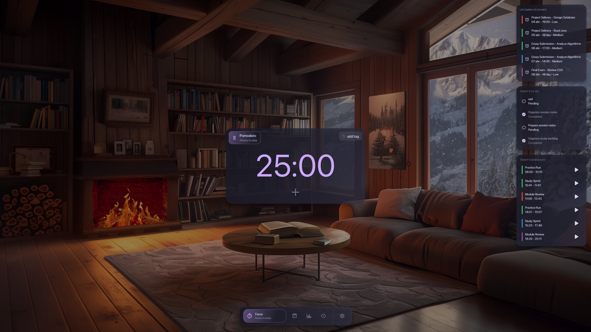
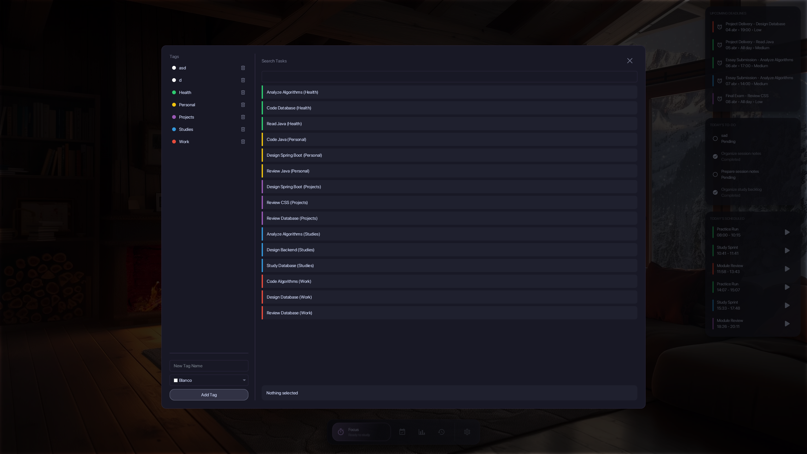
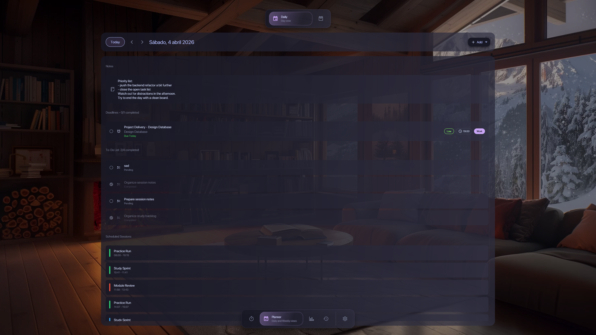
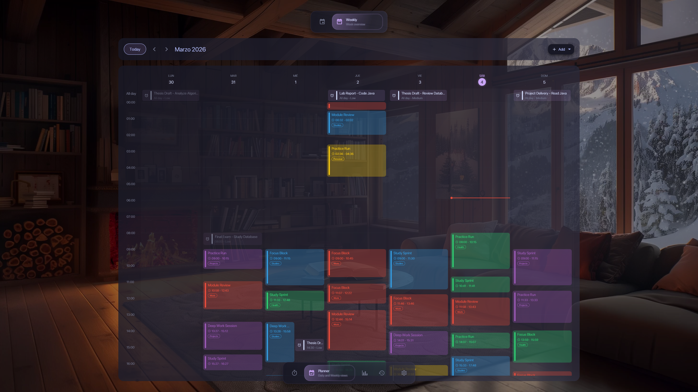
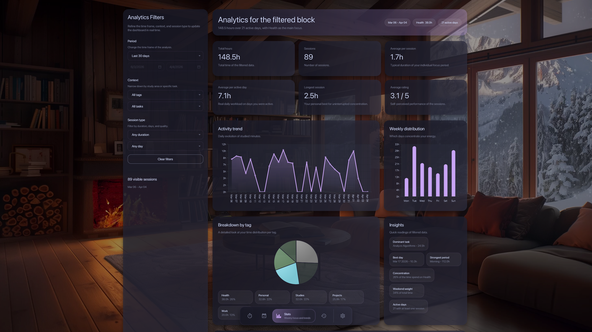
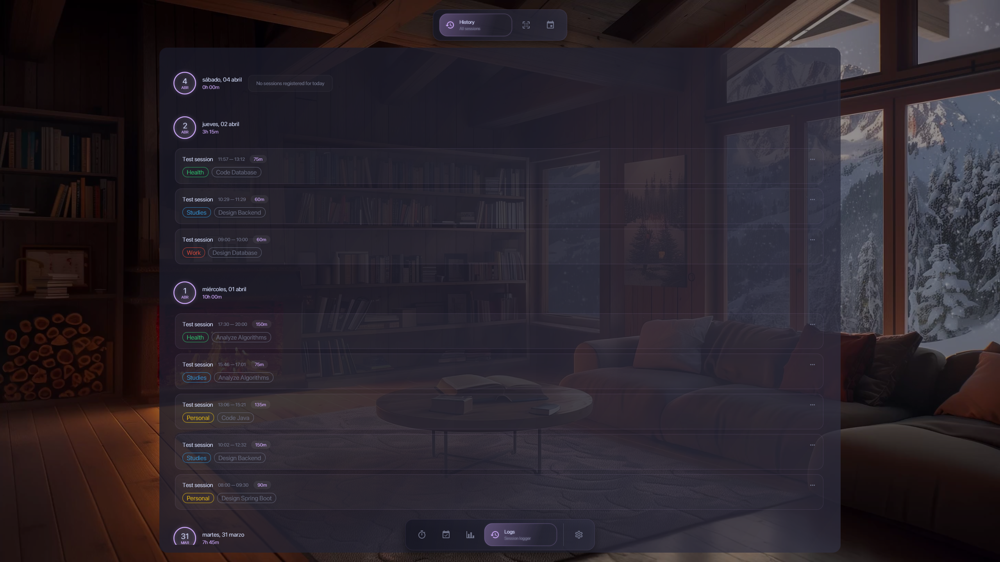
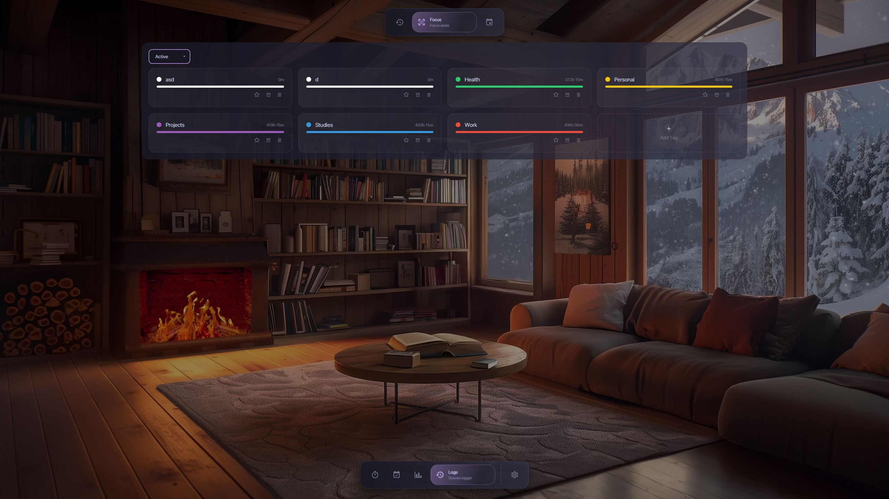
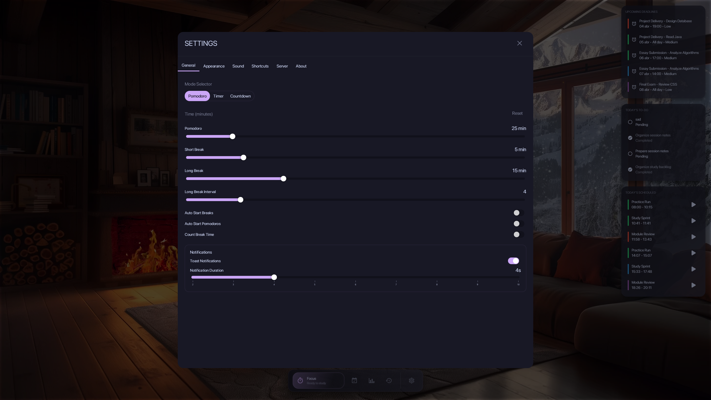

# 🎓 StudyZen

StudyZen is a self-hosted desktop app for people who want a personal study system they fully control.

It brings together focused session tracking, weekly planning, tasks, deadlines, logs, and progress insights in one place, while keeping your data on your own machine through a local backend.

## 🚀 Main Features

### ⏱️ Focus Tracking

- Pomodoro, Timer, and Countdown modes
- Session title, notes, duration, and rating
- A cleaner record of what you actually studied

### 📅 Planning

- Weekly planner
- Scheduled study blocks
- Deadlines and daily todos
- Tag and task organization

### 📊 Review

- Logs by history, calendar, and focus area
- Statistics dashboard with visual summaries
- Better feedback on workload and consistency

### 🖥️ Desktop Experience

- Multiple themes and fonts
- Sound and notification customization
- First-run guide and in-app backend setup
- Portable and installer-based frontend distribution

## 🖼️ Gallery

| Timer                     | Search                     |
|---------------------------|----------------------------|
|  |  |

| Planner Daily View                     | Planner Weekly View                     |
|----------------------------------------|-----------------------------------------|
|  |  |

| Stats                     | Log History                     |
|---------------------------|---------------------------------|
|  |  |

| Log Focus                     | Settings                     |
|-------------------------------|------------------------------|
|  |  |

## ⚙️ How It Works

StudyZen runs as a local self-hosted setup:

- a desktop frontend for the UI
- a backend API for data persistence
- a PostgreSQL database for storage

For the default setup, Docker Compose starts the backend and database locally, and the desktop app connects to them through:

```text
http://localhost:8080/api
```

## 🧭 Getting Started

### 1. 🛠️ Configure the local environment

Copy the example file:

```bash
cp .env.example .env
```

Default local setup:

```env
BACKEND_PUBLIC_PORT=8080
BACKEND_PRIVATE_PORT=8080
DB_PORT=5432
DB_NAME=studytracker
DB_USER=your_user
DB_PASSWORD=your_password
API_URL=http://localhost:8080/api
```

### 2. 🐳 Start the backend

You can do this in either of these ways:

- from the project root with the repository files
- from the backend release package `StudyZen-backend-v<version>.zip`

If you are using the backend package, extract it and work from:

```text
studyzen-backend/
```

That package is documented in [README-backend.md](README-backend.md).

Then start the services:

```bash
docker compose up -d
```

### 3. 🪟 Open the frontend

Use the desktop release build:

- `StudyTracker-v<version>-Setup.msi`
- `StudyTracker-v<version>-Portable.zip`

On first launch, the app will guide you through:

1. a short welcome flow
2. backend connection setup

For the default local setup, use:

```text
http://localhost:8080/api
```

Once saved, StudyZen remembers the server URL for future launches.

## 📦 Release Artifacts

The frontend is prepared to ship in two formats:

- **Windows Installer** for a standard desktop installation
- **Portable Build** for running the app without installation

The backend can also be shipped separately as:

- **StudyZen Backend**: `StudyZen-backend-v<version>.zip`

That backend package is intended to contain:

- `docker-compose.yml`
- `.env.example`
- `README-backend.md`

## 🧪 Build From Source

If you want to run the full project from source, you will need:

- Java 21 for the backend
- Java 25 for the frontend
- Maven 3.9+
- Docker Desktop

Run the frontend:

```bash
mvn -pl frontend javafx:run
```

Run backend + database:

```bash
docker compose up -d
```

## 🗂️ Project Layout

```text
StudyZen/
├── backend/
│   ├── src/main/java/com/frandm/studytracker/backend/
│   │   ├── config/
│   │   ├── controller/
│   │   ├── mapper/
│   │   ├── model/
│   │   ├── repository/
│   │   ├── service/
│   │   └── util/
│   ├── src/main/resources/
│   │   ├── application.yml
│   │   └── db/migration/
│   └── pom.xml
├── frontend/
│   ├── src/main/java/com/frandm/studytracker/
│   │   ├── client/
│   │   ├── controllers/
│   │   ├── core/
│   │   ├── models/
│   │   ├── ui/
│   │   │   ├── util/
│   │   │   └── views/
│   │   │       ├── dashboard/
│   │   │       ├── logs/
│   │   │       └── planner/
│   │   ├── App.java
│   │   └── Launcher.java
│   ├── src/main/resources/com/frandm/studytracker/
│   │   ├── css/
│   │   ├── fonts/
│   │   ├── fxml/
│   │   ├── images/
│   │   ├── sounds/
│   │   └── videos/
│   └── pom.xml
├── images/
├── dist/
├── .env
├── .env.example
├── docker-compose.yml
├── Dockerfile
├── LICENSE
├── pom.xml
└── README.md
```

## 🧱 Tech Stack

| Layer | Technology |
|---|---|
| Frontend | Java 25, JavaFX 23 |
| Backend | Java 21, Spring Boot 3 |
| Database | PostgreSQL 16 |
| Packaging | Maven Shade, jpackage |
| Deployment | Docker Compose |

## 💾 Local Data

StudyZen stores local preferences in:

```text
C:\Users\<user>\.StudyTracker\settings.properties
```

This includes things like:

- saved backend URL
- onboarding completion
- appearance settings
- sounds and notifications
- keyboard shortcuts

## 📄 License

StudyZen is licensed under the MIT License. See [LICENSE](LICENSE).

## 👤 Author

Fran Dorado
